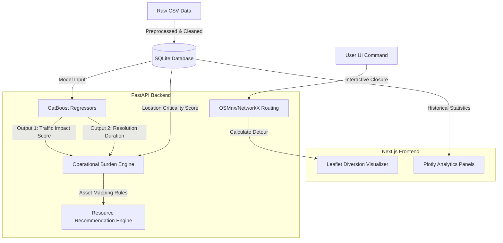

# TrafficOps: Event Traffic Impact Forecasting and Response System

**TrafficOps** is a lightweight, local-first, and highly explainable AI-powered traffic forecasting and resource recommendation dashboard. It has been specifically designed for the **Flipkart Gridlock Hackathon** to answer the core operational challenge:

> *"How can historical and real-time data be used to forecast event-related traffic impact and recommend optimal manpower, barricading, and diversion plans?"*

Developed with a professional dark control room theme, TrafficOps provides real-time event analytics, automated officer/barricade recommendations based on Operational Burden, and simulates road closures to compute diversions.

---

## 🏗️ Architecture Diagram



---

## 🛠️ Technology Stack

* **Machine Learning**: `CatBoost` Regressors (Impact Score, Resolution Time), `Scikit-Learn`, `Pandas`, `NumPy`.
* **Spatial & Maps**: `OSMnx`, `NetworkX`, `Folium` (Backend), `Leaflet` & `React-Leaflet` (Frontend).
* **Backend API**: `FastAPI` (Python), `Uvicorn`, `SQLite` database.
* **Frontend UI**: `Next.js` (TypeScript), `Tailwind CSS`, `Plotly.js` (interactive graphs).
* **Containerization**: `Docker` & `Docker Compose`.

---

## ⚡ Quick Setup & Run Instructions

You can run the application either directly on your host machine or via Docker.

### Option A: Running Locally (Recommended for Development)

#### 1. Backend Setup
1. Open a terminal and navigate to the project root:
   ```bash
   pip install -r requirements.txt
   ```
2. Parse the dataset and seed the SQLite database:
   ```bash
   python -m app.database
   ```
3. Train the CatBoost models:
   ```bash
   python train.py
   ```
4. Start the FastAPI development server:
   ```bash
   uvicorn app.main:app --reload
   ```
   *The backend will be accessible at `http://localhost:8000` (docs at `/docs`).*

#### 2. Frontend Setup
1. Open a new terminal and navigate to the `frontend/` directory:
   ```bash
   cd frontend
   npm install
   npm run dev
   ```
   *The control room dashboard will be accessible at `http://localhost:3000`.*

---

### Option B: Running with Docker (Zero-install Setup)

If you have Docker and Docker Compose installed, spin up the entire multi-service stack with a single command:
```bash
docker-compose up --build
```
*Docker Compose handles directory mounts (`./data` and `./models`), ensuring database changes and trained models persist on your host machine.*

---

## 💡 Engine Explanations

### 1. Location Criticality Score (Step 2)
Computes historical location frequency count for `junction` (50%), `corridor` (30%), and `zone` (20%). Locations that see recurrent breakdowns and congestion receive a higher score (0-100), increasing their overall burden ranking.

### 2. Traffic Impact Score (Step 3)
Generates a weighted score combining:
* Event Cause Severity Weight (25%)
* Event Priority Weight (20%)
* Requires Road Closure (25%)
* Resolution Time Logarithmic Score (15%)
* Location Criticality Score (15%)

### 3. Operational Burden Score (Step 5)
Formula:
$$\text{Burden Score} = 40\% \text{ Impact} + 30\% \text{ Duration} + 20\% \text{ Closure} + 10\% \text{ Criticality}$$

### 4. Resource Allocation Thresholds (Step 6)
Allocates manpower and assets dynamically (thresholds are stored in `data/resource_config.json` and are fully configurable):
* **0-20**: 2 Officers, 2 Barricades, 0 Patrol Vehicles
* **20-40**: 4 Officers, 4 Barricades, 1 Patrol Vehicle
* **40-60**: 8 Officers, 8 Barricades, 1 Patrol Vehicle
* **60-80**: 12 Officers, 15 Barricades, 2 Patrol Vehicles
* **80-100**: 20 Officers, 30 Barricades, 3 Patrol Vehicles

### 5. Diversion Routing Fallback (Step 7)
Uses OSMnx to dynamically download a 1km network around the coordinate, closes the closest road link, and routes alternative detours. If offline or download rates limit, it activates a geometric detour generator so the UI never blocks.
